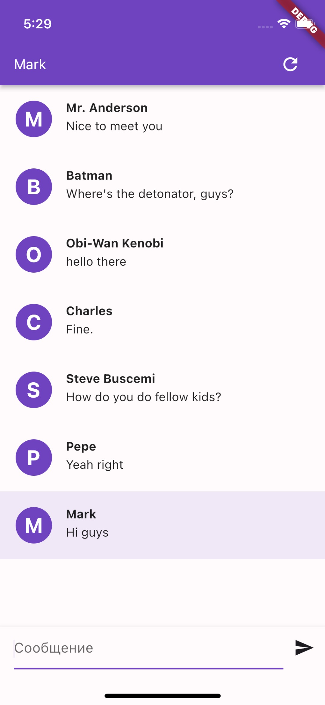
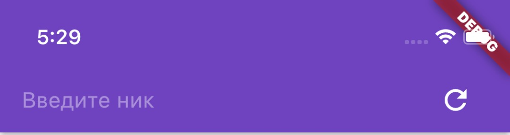
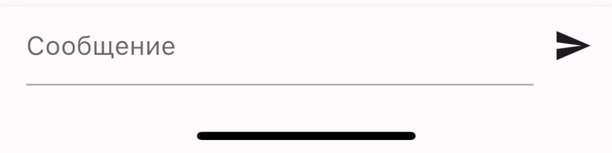
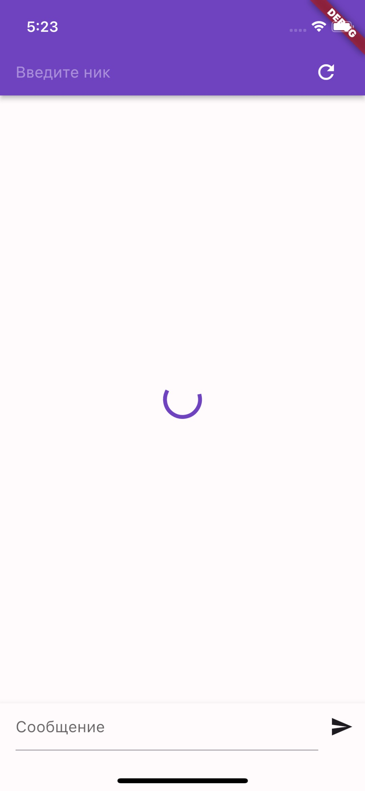
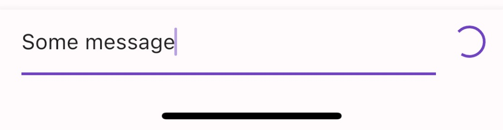
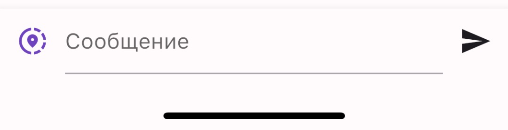
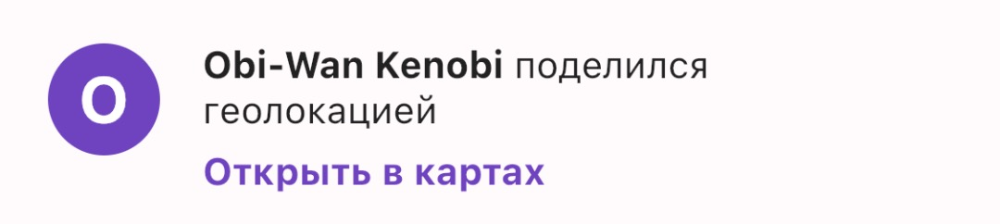

# Surf Flutter Study Jam Chat

## Задание

В ходе выполнения задания необходимо реализовать UI чата с возможностью отправки сообщения. Вам доступен интерфейс `ChatRepository`, который содержит методы доступа к данным сообщений (подробнее в документации).

Для реализации задания предлагается использовать виджеты из библиотеки `material`, но это не обязательное условие. Главное - в общем соответствовать макету и выполнить задания. То есть вас никто не удерживает от дополнительного функционала, а также от способов реализации!

Начать выполнение задание нужно будет с этого шаблонного репозитория. Вам нужно [форкнуть](https://docs.github.com/en/get-started/quickstart/fork-a-repo) репозиторий, залить изменения в свой уже скопированный репозиторий и отправить его нам.

### Основное

1. Реализовать верхний app bar с текстовым полем ввода имени и кнопкой обновления чата. В текстовом поле должен присутствовать hint "Введите ник".

Иконка `Icons.refresh`

2. Реализовать нижнюю панель с текстовым полем и кнопкой отправки сообщения. В текстовом поле должен присутвовать hint "Сообщение".

Иконка `Icons.send`

3. Реализовать отображение списка сообщений. Список должен обновляться по нажатию но кнопку обновления на верхней панели (отправка запроса `ChatRepository.messages`), а также после нажатия на кпоку отправки сообщения (отправка запроса `ChatRepository.sendMessage`).

4. На элементе списка должен присутствовать ник автора сообщения, само сообщение, а также аватарка, представляющая из себя круг с первой буквой ника посередине. Сообщение, отправленное от своего имени, должно выделяться от других сообщений (например, цветом, как на скриншотах). См. объекты `ChatUserDto` и `ChatUserLocalDto`.

### Экстра 🔥🔥🔥

1. Добавить состояния загрузки и обработки ошибок. Требуемые обработки состояний:

- Первоначальная загрузка с progress indicator
- Ошибка при первой загрузке: "Произошла ошибка"
- Ошибка при отправке сообщения в виде снекбара
- После отправки сообщения блокировать кнопку отправки и заменять её индикатором прогресса

2. Добавить возможность поделиться геолокацией. Слева от поля ввода сообщения на нижней панели необходимо добавить кнопку "Поделиться геолокацией". После нажатия на кнопку должен показываться алерт с подтверждением, после чего вызываться метод `ChatRepository.sendGeolocation` с данными геолокации. При отсутствии запрашивать разрешения.

Иконка `Icons.share_location_outlined`

3. Добавить сообщение в виде отображения геолокации. По тапу на сообщение открывать карту с геолокацией.

